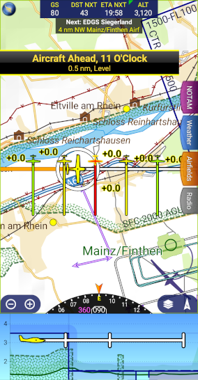
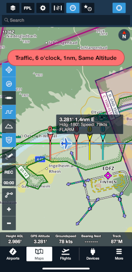
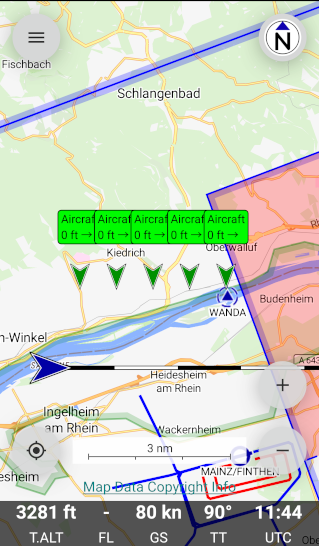

Airtraffic: NMEA/FLARM and GDL90 Simulator
==========================================

This is a command line tool to simulate a simple air traffic scenario
and send traffic information via NMEA/FLARM or GDL90 protocol to an
electronic flight bag application (EFB).

Getting Started
---------------

Prerequisites
~~~~~~~~~~~~~

 * Ruby 2.5, 2.6, 2.7 or 3.0
 * Electronic flight bag app (EFB) or other NMEA/FLARM/GDL90 receiver
   ** https://www.foreflight.com[ForeFlight]
   ** https://www.skydemon.aero/[SkyDemon]
   ** https://akaflieg-freiburg.github.io/enroute/[Enroute]

Installation
~~~~~~~~~~~~

----
git clone https://github.com/ra1fh/airtraffic.git
----

Usage
-----

The tool simulates the aircraft position flying east, 5 planes with
full position/distance information flying south and one bearingless
aircraft flying north, such that the EFB has a lot of traffic to
announce.

GDL90
~~~~~

Send GDL90 UDP packets to 10.1.1.1 port 4000:

----
ruby ./airtraffic.rb --gdl 10.1.1.1:4000
----

GDL90 does not support bearingless traffic, so the bearingless
aircraft is shown as normal traffic.

NMEA/FLARM
~~~~~~~~~~
	
Open NMEA listener on port 2000:

----
ruby ./airtraffic.rb --nmea 0.0.0.0:2000
----

The target IP is not configurable within the EFB app, so the network
has to be set up such that the EFB can connect 192.168.1.1:2000. The
network has to route to the listener via port forwarding, dedicated
WLAN or other means.

The bearingless aircraft is presented in the NMEA PFLAA record with
distance in "RelativeNorth" field and empty "RelativeEast". The only
EFB supporting bearingless aircraft is SkyDemon in NMEA/FLARM
mode.

Multiple connections are possible.

Usage on OpenWRT
~~~~~~~~~~~~~~~~

Tested with OpenWRT 22.03.2 on a device with 16M flash.

Connect to the LAN port of device and copy the script:
----
scp airtraffic.rb root@192.168.1.1:    # OpenSSH < 9.0
scp -O airtraffic.rb root@192.168.1.1: # OpenSSH >= 9.0
----

Setup network access via web interface and connect with SSH to install
prerequisites:

----
root@OpenWrt:~# opkg update
root@OpenWrt:~# opkg install ruby ruby-optparse ruby-socket
----

Reconfigure the device's wireless network to "Master" mode, assign an
IP and enable DHCP. Connect the EFB to the new wireless network and
start the script (you may need to adjust the GDL90 IP):

----
root@OpenWrt:~# ruby ./airtraffic.rb --nmea 0.0.0.0:2000 --gdl 10.1.1.1:4000
----

EFB configuration notes
-----------------------

SkyDemon
~~~~~~~~

 * NMEA/FLARM
   ** Enable the device: Setup -> Third-Party Devices -> FLARM Devices -> Air Avionics AT-1
   ** Start with: Fly -> Use Air Avionics AT-1
   ** SkyDemon will connect to TCP 192.168.1.1:2000
 * GDL90
   ** Enable the device: Setup -> GDL90 Compatible Device
   ** Start with: Fly -> Use GDL90 Compatible Device
   ** Send GDL90 traffic to the IP of your mobile device, destination port 4000
 
ForeFlight
~~~~~~~~~~

 * NMEA/FLARM
   ** ForeFlight automatically connects to TCP 192.168.1.1:2000 on startup
 * GDL90
   ** ForeFlight automatically opens an UDP listener on port 4000 on startup
   ** Send GDL90 traffic to the IP of your mobile device, destination port 4000

Enroute
~~~~~~~

 ** Open Menu -> Information -> Traffic Receiver
 ** The page explains how to connect and allows to trigger connection attempts

Changelog
---------

 ** 2023-05-28: Removed EventMachine dependency. Added OpenWRT instructions.
